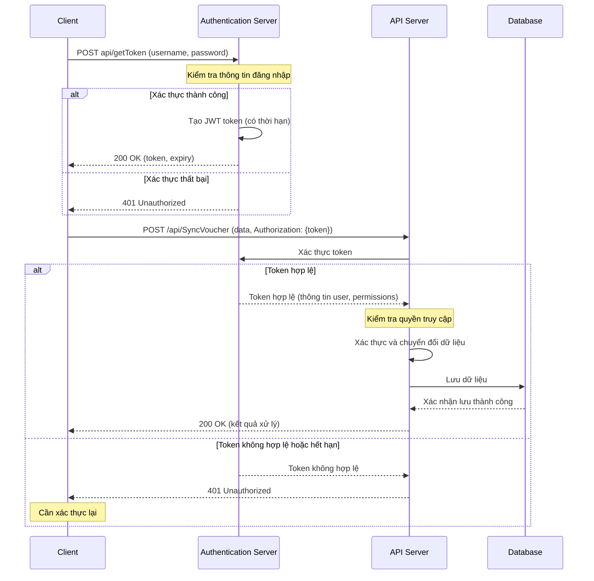

import ThemedImage from '@theme/ThemedImage';

# Fast ERP - Tích hợp kỹ thuật

## Giới thiệu

API của Fast ERP được xây dựng trên nền tảng .NET, cung cấp khả năng nhận dữ liệu danh mục, chứng từ và dữ liệu giao dịch từ các hệ thống của đối tác.

## Tính năng chính

- **Xác thực bảo mật**: Hệ thống sử dụng token-based authentication để đảm bảo an toàn cho API.
- **Đồng bộ dữ liệu master**: Hỗ trợ đồng bộ các dữ liệu danh mục như khách hàng, vật tư, vụ việc...
- **Đồng bộ chứng từ phức tạp**: Hỗ trợ đồng bộ các dữ liệu chứng từ đa cấp như hóa đơn mua hàng, hóa đơn bán hàng...
- **Truy vấn dữ liệu**: Cung cấp khả năng truy vấn dữ liệu từ hệ thống.

## Luồng xử lý dữ liệu

<figure style={{textAlign: 'center'}}>
  <figcaption style={{marginTop: '10px', fontSize: '14px', fontStyle: 'italic'}}>
    Hình 1: Sơ đồ luồng xử lý dữ liệu API
  </figcaption>
</figure>

### 1. Xác thực và lấy token

- Client gửi request xác thực với thông tin đăng nhập (username/password).
- Hệ thống xác thực thông tin và tạo token.
- Token được trả về cho client kèm thời hạn sử dụng.

### 2. Gửi yêu cầu xử lý dữ liệu

- Client gửi request có kèm token xác thực trong header.
- API xác thực token và quyền truy cập.

### 3. Xử lý dữ liệu

- Dữ liệu hợp lệ được chuyển đổi và lưu vào cơ sở dữ liệu.
- Hệ thống xử lý nghiệp vụ liên quan.

### 4. Phản hồi

- Kết quả xử lý được trả về cho client.
- Trong trường hợp token hết hạn, hệ thống trả về mã lỗi yêu cầu client xác thực lại.

## Bắt đầu tích hợp

Để bắt đầu sử dụng API, bạn cần:

1. Đăng ký và nhận thông tin xác thực (username/password).
2. Tìm hiểu về [xác thực và bảo mật](./authentication).
3. Khám phá các endpoint API sẵn có trong danh sách sau :

| API                                            | Format                | API Defined by |
| ---------------------------------------------- | --------------------- | -------------- |
| [Đồng bộ dữ liệu danh mục](./api/sync-data)    | POST /api/SyncData    | Fast           |
| [Đồng bộ dữ liệu chứng từ](./api/sync-voucher) | POST /api/SyncVoucher | Fast           |
| [Lấy dữ liệu](./api/get-data)                  | POST /api/GetData     | Fast           |
