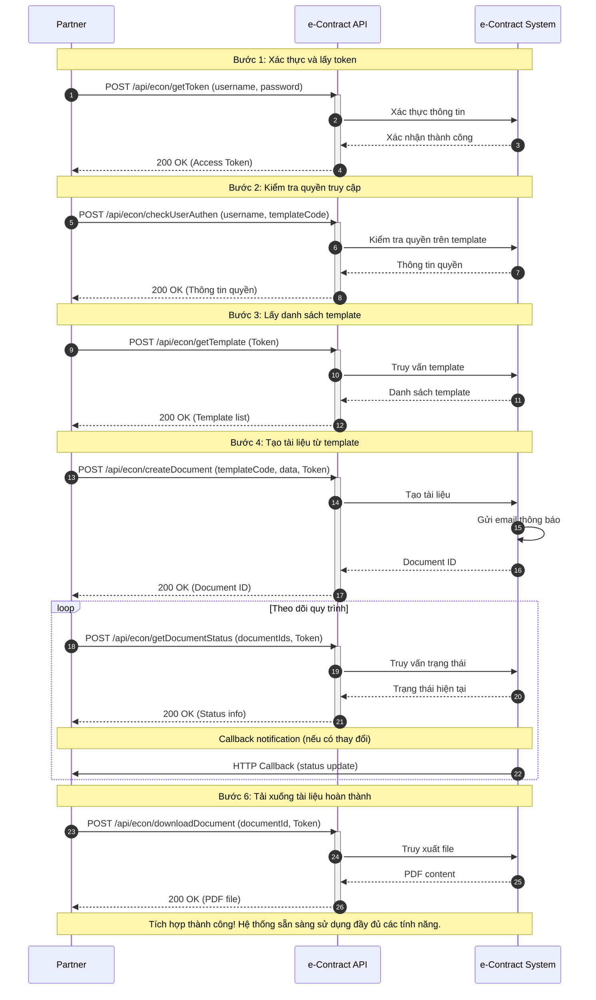

# Fast e-Contract - Tích hợp kỹ thuật

## Tổng quan

Chào mừng bạn đến với **Fast e-Contract** - Giải pháp ký điện tử và quản lý hợp đồng số của Fast.

### Giới thiệu

Fast e-Contract cung cấp các APIs mạnh mẽ để đối tác có thể tích hợp các tính năng:

- 📝 **Tạo tài liệu điện tử** - Tạo hợp đồng từ template có sẵn
- ✍️ **Ký số điện tử** - Ký và phê duyệt tài liệu trực tuyến
- 📊 **Quản lý trạng thái** - Theo dõi quy trình ký và phê duyệt
- 📋 **Lịch sử hoạt động** - Truy vết và audit trail đầy đủ
- 📥 **Tải xuống tài liệu** - Download file PDF đã hoàn thành
- 🔔 **Callback thông báo** - Nhận thông báo real-time khi có thay đổi

### Quy trình tích hợp Fast e-Contract



## Cách thức gọi API

### Cách thức truyền

- **Base URL**: `http://domain:port/api/econ/`
- **Method**: `POST`
- **Request Headers**:
  ```http
  Content-Type: application/json
  Authorization: {accessToken}
  ```

### Format Response chuẩn

Tất cả API đều trả về dữ liệu dạng JSON với cấu trúc:

```json
{
  "success": boolean,
  "message": string,
  "code": number,
  "data": object|array|null
}
```

#### Response Fields

| Attribute | Type         | Description                       |
| --------- | ------------ | --------------------------------- |
| `success` | boolean      | Trạng thái thành công của request |
| `message` | string       | Thông báo kết quả                 |
| `code`    | number       | HTTP status code                  |
| `data`    | object/array | Dữ liệu phản hồi (nếu có)         |

## Hướng dẫn tích hợp nhanh

### Bước 1: Xác thực

```javascript
// 1. Lấy token
const authResponse = await fetch("http://domain:port/api/econ/getToken", {
  method: "POST",
  headers: { "Content-Type": "application/json" },
  body: JSON.stringify({
    username: "your_username",
    password: "your_password",
  }),
});

const authResult = await authResponse.json();
const token = authResult.data.accessToken;
```

### Bước 2: Lấy danh sách template

```javascript
// 2. Lấy template
const templateResponse = await fetch(
  "http://domain:port/api/econ/getTemplate",
  {
    method: "POST",
    headers: {
      "Content-Type": "application/json",
      Authorization: token,
    },
    body: JSON.stringify({}),
  }
);

const templates = await templateResponse.json();
console.log("Available templates:", templates.data);
```

### Bước 3: Tạo tài liệu

```javascript
// 3. Tạo tài liệu
const createResponse = await fetch(
  "http://domain:port/api/econ/createDocument",
  {
    method: "POST",
    headers: {
      "Content-Type": "application/json",
      Authorization: token,
    },
    body: JSON.stringify({
      templateCode: "TEMPLATE_001",
      documentData: {
        buyer_name: "Công ty ABC",
        seller_name: "Công ty XYZ",
        contract_date: "2024-08-21",
        total_amount: 1000000000,
      },
      signers: [
        {
          email: "signer1@company.com",
          fullName: "Nguyễn Văn A",
          order: 1,
        },
        {
          email: "signer2@company.com",
          fullName: "Trần Thị B",
          order: 2,
        },
      ],
      callbackUrl: "https://yourapp.com/webhook/econtract",
    }),
  }
);

const document = await createResponse.json();
console.log("Document created:", document.data.documentId);
```

### Bước 4: Theo dõi trạng thái

```javascript
// 4. Kiểm tra trạng thái
const statusResponse = await fetch(
  "http://domain:port/api/econ/getDocumentStatus",
  {
    method: "POST",
    headers: {
      "Content-Type": "application/json",
      Authorization: token,
    },
    body: JSON.stringify({
      documentIds: [document.data.documentId],
    }),
  }
);

const status = await statusResponse.json();
console.log("Document status:", status.data.arr_status[0]);
```

## Tài liệu chi tiết

Khám phá các phần sau để tìm hiểu chi tiết về từng API:

- **[Xác thực & Quyền](/econtract/authentication/get-token)** - Lấy token và kiểm tra quyền
- **[Quản lý Template](/econtract/template/get-template)** - Làm việc với templates
- **[Quản lý Tài liệu](/econtract/document/create-document)** - Tạo và quản lý documents

---

**Bắt đầu với [GetToken API](/econtract/authentication/get-token) để lấy access token đầu tiên.**
