# Fast e-Contract - Tích hợp kỹ thuật

## Tổng quan

Chào mừng bạn đến với **Fast e-Contract** - Giải pháp ký điện tử và quản lý hợp đồng số của Fast.

### Giới thiệu

Fast e-Contract cung cấp các APIs mạnh mẽ để đối tác có thể tích hợp các tính năng:

- 📝 **Tạo tài liệu điện tử** - Tạo hợp đồng từ template có sẵn
- ✍️ **Ký số điện tử** - Ký và phê duyệt tài liệu trực tuyến
- 📊 **Quản lý trạng thái** - Theo dõi quy trình ký và phê duyệt
- 📋 **Lịch sử hoạt động** - Truy vết và audit trail đầy đủ
- 📥 **Tải xuống tài liệu** - Download file PDF đã hoàn thành
- 🔔 **Callback thông báo** - Nhận thông báo real-time khi có thay đổi

### Quy trình tích hợp Fast e-Contract

```mermaid
sequenceDiagram
    autonumber
    participant Partner
    participant API as e-Contract API
    participant System as e-Contract System

    %% Bước 1: Xác thực
    Note over Partner,System: Bước 1: Xác thực và lấy token
    Partner->>API: POST /api/econ/getToken (username, password)
    activate API
    API->>System: Xác thực thông tin
    System-->>API: Xác nhận thành công
    API-->>Partner: 200 OK (Access Token)
    deactivate API

    %% Bước 2: Kiểm tra quyền
    Note over Partner,System: Bước 2: Kiểm tra quyền truy cập
    Partner->>API: POST /api/econ/checkUserAuthen (username, templateCode)
    activate API
    API->>System: Kiểm tra quyền trên template
    System-->>API: Thông tin quyền
    API-->>Partner: 200 OK (Thông tin quyền)
    deactivate API

    %% Bước 3: Lấy template
    Note over Partner,System: Bước 3: Lấy danh sách template
    Partner->>API: POST /api/econ/getTemplate (Token)
    activate API
    API->>System: Truy vấn template
    System-->>API: Danh sách template
    API-->>Partner: 200 OK (Template list)
    deactivate API

    %% Bước 4: Tạo tài liệu
    Note over Partner,System: Bước 4: Tạo tài liệu từ template
    Partner->>API: POST /api/econ/createDocument (templateCode, data, Token)
    activate API
    API->>System: Tạo tài liệu
    System->>System: Gửi email thông báo
    System-->>API: Document ID
    API-->>Partner: 200 OK (Document ID)
    deactivate API

    %% Bước 5: Theo dõi trạng thái
    loop Theo dõi quy trình
        Partner->>API: POST /api/econ/getDocumentStatus (documentIds, Token)
        activate API
        API->>System: Truy vấn trạng thái
        System-->>API: Trạng thái hiện tại
        API-->>Partner: 200 OK (Status info)
        deactivate API

        Note over Partner,System: Callback notification (nếu có thay đổi)
        System->>Partner: HTTP Callback (status update)
    end

    %% Bước 6: Tải xuống
    Note over Partner,System: Bước 6: Tải xuống tài liệu hoàn thành
    Partner->>API: POST /api/econ/downloadDocument (documentId, Token)
    activate API
    API->>System: Truy xuất file
    System-->>API: PDF content
    API-->>Partner: 200 OK (PDF file)
    deactivate API

    Note over Partner,System: Tích hợp thành công! Hệ thống sẵn sàng sử dụng đầy đủ các tính năng.
```

## Tài liệu chi tiết

Khám phá các phần sau để tìm hiểu chi tiết về từng API:

- **[Xác thực & Quyền](/econtract/authentication/get-token)** - Lấy token và kiểm tra quyền
- **[Quản lý Template](/econtract/template/get-template)** - Làm việc với templates
- **[Quản lý Tài liệu](/econtract/document/create-document)** - Tạo và quản lý documents

---

**Bắt đầu với [GetToken API](/econtract/authentication/get-token) để lấy access token đầu tiên.**
