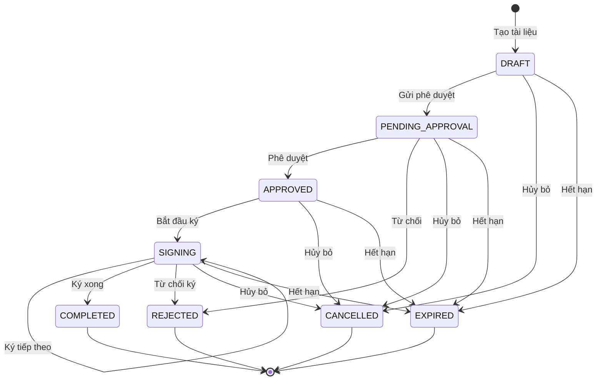

# GetStatusList

## Endpoint

> ```http
> POST /api/econ/getStatusList
> ```

## Mô tả

Lấy danh sách trạng thái tài liệu trên hệ thống eContract.

## Headers

```http
Content-Type: application/json
Authorization: {accessToken}
```

:::info Xác thực bắt buộc
API này yêu cầu token xác thực. Vui lòng tham khảo [GetToken API](/econtract/authentication/get-token) để lấy token.
:::

## Request Body

```json
{}
```

## Response

### Thành công (200 OK)

```json
{
  "success": true,
  "message": "Successfully",
  "code": 200,
  "data": [
    {
      "statusId": 1,
      "statusCode": "DRAFT",
      "statusName": "Nháp",
      "description": "Tài liệu đang trong trạng thái soạn thảo"
    },
    {
      "statusId": 2,
      "statusCode": "PENDING_APPROVAL",
      "statusName": "Chờ phê duyệt",
      "description": "Tài liệu đang chờ phê duyệt"
    },
    {
      "statusId": 3,
      "statusCode": "APPROVED",
      "statusName": "Đã phê duyệt",
      "description": "Tài liệu đã được phê duyệt"
    },
    {
      "statusId": 4,
      "statusCode": "SIGNING",
      "statusName": "Đang ký",
      "description": "Tài liệu đang trong quá trình ký"
    },
    {
      "statusId": 5,
      "statusCode": "COMPLETED",
      "statusName": "Hoàn thành",
      "description": "Tài liệu đã hoàn thành"
    },
    {
      "statusId": 6,
      "statusCode": "REJECTED",
      "statusName": "Từ chối",
      "description": "Tài liệu bị từ chối"
    },
    {
      "statusId": 7,
      "statusCode": "CANCELLED",
      "statusName": "Hủy bỏ",
      "description": "Tài liệu đã bị hủy bỏ"
    },
    {
      "statusId": 8,
      "statusCode": "EXPIRED",
      "statusName": "Hết hạn",
      "description": "Tài liệu đã hết hạn"
    }
  ]
}
```

### Thất bại

```json
{
  "success": false,
  "message": "Unable to fetch status list",
  "code": 500,
  "data": null
}
```

## Response Fields

| Attribute     | Type    | Description                       |
| ------------- | ------- | --------------------------------- |
| `success`     | boolean | Trạng thái thành công của request |
| `message`     | string  | Thông báo kết quả                 |
| `code`        | number  | HTTP status code                  |
| `data`        | array   | Danh sách trạng thái              |
| `statusId`    | number  | ID trạng thái                     |
| `statusCode`  | string  | Mã trạng thái                     |
| `statusName`  | string  | Tên hiển thị trạng thái           |
| `description` | string  | Mô tả chi tiết trạng thái         |

## Status Codes Reference

| Status Code        | Status Name   | Description                                | Next Possible States           |
| ------------------ | ------------- | ------------------------------------------ | ------------------------------ |
| `DRAFT`            | Nháp          | Tài liệu đang soạn thảo, chưa gửi đi       | PENDING_APPROVAL, CANCELLED    |
| `PENDING_APPROVAL` | Chờ phê duyệt | Tài liệu đã gửi, đang chờ phê duyệt        | APPROVED, REJECTED, CANCELLED  |
| `APPROVED`         | Đã phê duyệt  | Tài liệu đã được phê duyệt, sẵn sàng ký    | SIGNING, CANCELLED             |
| `SIGNING`          | Đang ký       | Tài liệu đang trong quá trình ký số        | COMPLETED, REJECTED, CANCELLED |
| `COMPLETED`        | Hoàn thành    | Tất cả bên đã ký, tài liệu hoàn tất        | (Final state)                  |
| `REJECTED`         | Từ chối       | Tài liệu bị từ chối bởi người phê duyệt/ký | (Final state)                  |
| `CANCELLED`        | Hủy bỏ        | Tài liệu bị hủy bỏ bởi người tạo           | (Final state)                  |
| `EXPIRED`          | Hết hạn       | Tài liệu vượt quá deadline được đặt        | (Final state)                  |

## Status Flow Diagram



## Code Examples

### cURL

```bash
curl -X POST https://domain/api/econ/getStatusList \
  -H "Content-Type: application/json" \
  -H "Authorization: your_access_token" \
  -d '{}'
```

### JavaScript

```javascript
const getStatusList = async (token) => {
  try {
    const response = await fetch("https://domain/api/econ/getStatusList", {
      method: "POST",
      headers: {
        "Content-Type": "application/json",
        Authorization: token,
      },
      body: JSON.stringify({}),
    });

    const result = await response.json();

    if (result.success) {
      console.log("Available statuses:", result.data);
      return result.data;
    } else {
      throw new Error(result.message);
    }
  } catch (error) {
    console.error("Failed to get status list:", error);
    return null;
  }
};

// Sử dụng
const token = localStorage.getItem("econtract_token");
const statuses = await getStatusList(token);

if (statuses && statuses.length > 0) {
  statuses.forEach((status) => {
    console.log(
      `${status.statusCode}: ${status.statusName} - ${status.description}`
    );
  });
} else {
  console.log("No status list available");
}
```

### C# (.NET)

```csharp
public class GetStatusListResponse
{
    public bool success { get; set; }
    public string message { get; set; }
    public int code { get; set; }
    public StatusData[] data { get; set; }
}

public class StatusData
{
    public int statusId { get; set; }
    public string statusCode { get; set; }
    public string statusName { get; set; }
    public string description { get; set; }
}

// Sử dụng
public async Task<StatusData[]> GetStatusListAsync(string token)
{
    var client = new HttpClient();
    client.DefaultRequestHeaders.Add("Authorization", token);

    var content = new StringContent("{}", Encoding.UTF8, "application/json");
    var response = await client.PostAsync("https://domain/api/econ/getStatusList", content);
    var responseJson = await response.Content.ReadAsStringAsync();
    var result = JsonSerializer.Deserialize<GetStatusListResponse>(responseJson);

    return result.success ? result.data : new StatusData[0];
}
```

## Use Cases

### 1. Tạo status dropdown/filter

```javascript
const buildStatusFilter = async (token) => {
  const statuses = await getStatusList(token);

  const filterSelect = document.getElementById("status-filter");
  filterSelect.innerHTML = '<option value="">Tất cả trạng thái</option>';

  statuses.forEach((status) => {
    const option = document.createElement("option");
    option.value = status.statusCode;
    option.textContent = status.statusName;
    filterSelect.appendChild(option);
  });
};
```

### 2. Hiển thị status với màu sắc

```javascript
const getStatusColor = (statusCode) => {
  const statusColors = {
    DRAFT: "#6c757d", // Gray
    PENDING_APPROVAL: "#ffc107", // Yellow
    APPROVED: "#17a2b8", // Teal
    SIGNING: "#007bff", // Blue
    COMPLETED: "#28a745", // Green
    REJECTED: "#dc3545", // Red
    CANCELLED: "#6c757d", // Gray
    EXPIRED: "#fd7e14", // Orange
  };

  return statusColors[statusCode] || "#6c757d";
};

const renderStatusBadge = (statusCode, statusName) => {
  const color = getStatusColor(statusCode);
  return `<span class="status-badge" style="background-color: ${color}; color: white; padding: 4px 8px; border-radius: 4px;">${statusName}</span>`;
};
```

### 3. Validation trạng thái transitions

```javascript
const validateStatusTransition = (currentStatus, newStatus, statuses) => {
  const validTransitions = {
    DRAFT: ["PENDING_APPROVAL", "CANCELLED"],
    PENDING_APPROVAL: ["APPROVED", "REJECTED", "CANCELLED"],
    APPROVED: ["SIGNING", "CANCELLED"],
    SIGNING: ["COMPLETED", "REJECTED", "CANCELLED"],
    COMPLETED: [], // Final state
    REJECTED: [], // Final state
    CANCELLED: [], // Final state
    EXPIRED: [], // Final state
  };

  const allowedNextStates = validTransitions[currentStatus] || [];

  if (!allowedNextStates.includes(newStatus)) {
    const currentStatusInfo = statuses.find(
      (s) => s.statusCode === currentStatus
    );
    const newStatusInfo = statuses.find((s) => s.statusCode === newStatus);

    throw new Error(
      `Cannot transition from "${currentStatusInfo?.statusName}" to "${newStatusInfo?.statusName}"`
    );
  }

  return true;
};
```

### 4. Status progress tracking

```javascript
const calculateProgress = (currentStatus) => {
  const statusProgression = {
    DRAFT: 10,
    PENDING_APPROVAL: 25,
    APPROVED: 50,
    SIGNING: 75,
    COMPLETED: 100,
    REJECTED: -1, // Error state
    CANCELLED: -1, // Error state
    EXPIRED: -1, // Error state
  };

  return statusProgression[currentStatus] || 0;
};

const renderProgressBar = (currentStatus) => {
  const progress = calculateProgress(currentStatus);

  if (progress === -1) {
    return `<div class="progress-bar error">Document ended with status: ${currentStatus}</div>`;
  }

  return `
    <div class="progress">
      <div class="progress-bar" style="width: ${progress}%">${progress}%</div>
    </div>
  `;
};
```

### 5. Status-based action buttons

```javascript
const getAvailableActions = (currentStatus, userPermissions) => {
  const actions = [];

  switch (currentStatus) {
    case "DRAFT":
      if (userPermissions.includes("EDIT")) actions.push("edit");
      if (userPermissions.includes("SUBMIT")) actions.push("submit");
      if (userPermissions.includes("DELETE")) actions.push("cancel");
      break;

    case "PENDING_APPROVAL":
      if (userPermissions.includes("APPROVE")) actions.push("approve");
      if (userPermissions.includes("REJECT")) actions.push("reject");
      if (userPermissions.includes("CANCEL")) actions.push("cancel");
      break;

    case "APPROVED":
      if (userPermissions.includes("SIGN")) actions.push("start_signing");
      if (userPermissions.includes("CANCEL")) actions.push("cancel");
      break;

    case "SIGNING":
      if (userPermissions.includes("SIGN")) actions.push("sign");
      if (userPermissions.includes("REJECT")) actions.push("reject");
      if (userPermissions.includes("CANCEL")) actions.push("cancel");
      break;

    case "COMPLETED":
      if (userPermissions.includes("DOWNLOAD")) actions.push("download");
      if (userPermissions.includes("VIEW")) actions.push("view");
      break;

    case "REJECTED":
    case "CANCELLED":
    case "EXPIRED":
      if (userPermissions.includes("VIEW")) actions.push("view");
      break;
  }

  return actions;
};
```

## Caching Strategy

```javascript
class StatusListCache {
  constructor() {
    this.cache = null;
    this.cacheTime = null;
    this.cacheDuration = 30 * 60 * 1000; // 30 minutes
  }

  async getStatusList(token) {
    const now = Date.now();

    // Return cached data if still valid
    if (
      this.cache &&
      this.cacheTime &&
      now - this.cacheTime < this.cacheDuration
    ) {
      return this.cache;
    }

    // Fetch new data
    const statuses = await getStatusList(token);

    if (statuses) {
      this.cache = statuses;
      this.cacheTime = now;
    }

    return statuses;
  }

  clearCache() {
    this.cache = null;
    this.cacheTime = null;
  }
}

// Sử dụng
const statusCache = new StatusListCache();
const statuses = await statusCache.getStatusList(token);
```

## Error Handling

| Code | Message                     | Cause              | Solution                     |
| ---- | --------------------------- | ------------------ | ---------------------------- |
| 401  | Unauthorized                | Token không hợp lệ | Re-authenticate              |
| 500  | Unable to fetch status list | Lỗi hệ thống       | Thử lại hoặc liên hệ support |

:::tip Performance Tip
Status list thường ít thay đổi, nên có thể cache kết quả trong 30 phút để giảm số lần gọi API.
:::

---

**Tiếp theo:** Tìm hiểu [CreateDocument API](/econtract/document/create-document) để tạo tài liệu mới từ template.
