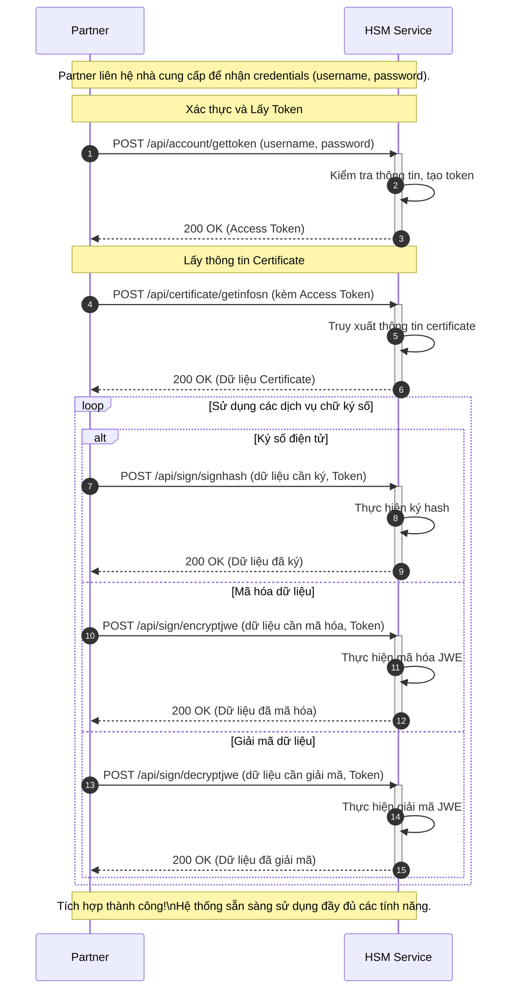

# Fast HSM - Tích hợp kỹ thuật

Chào mừng bạn đến với **Fast HSM** - Giải pháp ký số và mã hóa dữ liệu an toàn của Fast.

## Giới thiệu

Fast HSM cung cấp các APIs mạnh mẽ để đối tác có thể tích hợp các tính năng:

- 🔐 **Ký số điện tử** - Ký số các tài liệu, dữ liệu quan trọng
- 🛡️ **Mã hóa dữ liệu** - Mã hóa/giải mã theo chuẩn JWE (AES)
- 📋 **Quản lý chứng thư số** - Lấy thông tin và quản lý certificates
- 🔑 **Xác thực an toàn** - Hệ thống token-based authentication

## Quy trình tích hợp Fast HSM

## Lợi ích

### ✅ Bảo mật cao

- Chứng thư số được lưu trữ an toàn trong HSM
- Mã hóa theo chuẩn quốc tế JWE (AES)
- Token-based authentication

### ✅ Dễ tích hợp

- RESTful APIs đơn giản
- Documentation chi tiết với examples
- Hỗ trợ multiple hash signing

### ✅ Hiệu suất cao

- Xử lý batch signing (nhiều hash cùng lúc)
- Response time nhanh
- Scalable architecture

## Các APIs có sẵn

| API                          | Mục đích                   | Phương thức |
| ---------------------------- | -------------------------- | ----------- |
| `/api/account/gettoken`      | Xác thực và lấy token      | POST        |
| `/api/certificate/getinfosn` | Lấy thông tin chứng thư số | POST        |
| `/api/sign/encryptjwe`       | Mã hóa dữ liệu theo JWE    | POST        |
| `/api/sign/decryptjwe`       | Giải mã dữ liệu JWE        | POST        |
| `/api/sign/signhash`         | Ký số dữ liệu (batch)      | POST        |

## Bắt đầu

1. **[Xác thực và bảo mật](/hsm/authentication)** - Tìm hiểu cách lấy token
2. **[Quản lý chứng thư số](/hsm/certificate)** - APIs về certificate
3. **[Mã hóa dữ liệu](/hsm/encryption)** - Encrypt/Decrypt với JWE
4. **[Ký số điện tử](/hsm/signing)** - Digital signature APIs

## Hỗ trợ

- 📧 **Email**: info@fast.com.vn
- 📞 **Hotline**: (028) 7108-8788 (Ext. 3)
- 🌐 **Website**: [fast.com.vn](https://fast.com.vn)

---

**Sẵn sàng bắt đầu?** Hãy bắt đầu với [Xác thực và bảo mật](/hsm/authentication) để lấy token truy cập.
