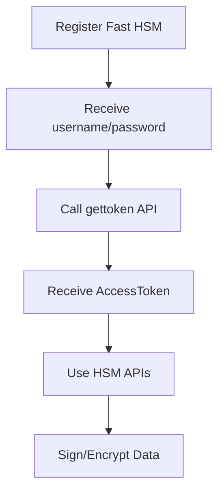

# Fast HSM Overview

Welcome to **Fast HSM (Hardware Security Module)** - Fast's secure digital signing and data encryption solution.

## Introduction

Fast HSM provides powerful APIs for partners to integrate:

- 🔐 **Digital Signature** - Sign documents and critical data
- 🛡️ **Data Encryption** - Encrypt/decrypt using JWE (AES) standard
- 📋 **Certificate Management** - Retrieve and manage certificates information
- 🔑 **Secure Authentication** - Token-based authentication system

## Integration Process

## Benefits

### ✅ High Security

- Certificates stored securely in HSM
- Encryption following international JWE (AES) standard
- Token-based authentication

### ✅ Easy Integration

- Simple RESTful APIs
- Detailed documentation with examples
- Support for multiple hash signing

### ✅ High Performance

- Batch signing processing (multiple hashes at once)
- Fast response time
- Scalable architecture

## Available APIs

| API                          | Purpose                      | Method |
| ---------------------------- | ---------------------------- | ------ |
| `/api/account/gettoken`      | Authentication and get token | POST   |
| `/api/certificate/getinfosn` | Get certificate information  | POST   |
| `/api/sign/encryptjwe`       | Encrypt data using JWE       | POST   |
| `/api/sign/decryptjwe`       | Decrypt JWE data             | POST   |
| `/api/sign/signhash`         | Sign data (batch)            | POST   |

## Getting Started

1. **[Authentication & Security](/hsm/authentication)** - Learn how to get token
2. **[Certificate Management](/hsm/certificate)** - Certificate APIs
3. **[Data Encryption](/hsm/encryption)** - Encrypt/Decrypt with JWE
4. **[Digital Signature](/hsm/signing)** - Digital signature APIs

## Support

- 📧 **Email**: hsm-support@fast.com.vn
- 📞 **Hotline**: (028) 7108-8788 (Ext. 3)
- 🌐 **Website**: [fast.com.vn/hsm](https://fast.com.vn/hsm)

---

**Ready to start?** Begin with [Authentication & Security](/hsm/authentication) to get your access token.
