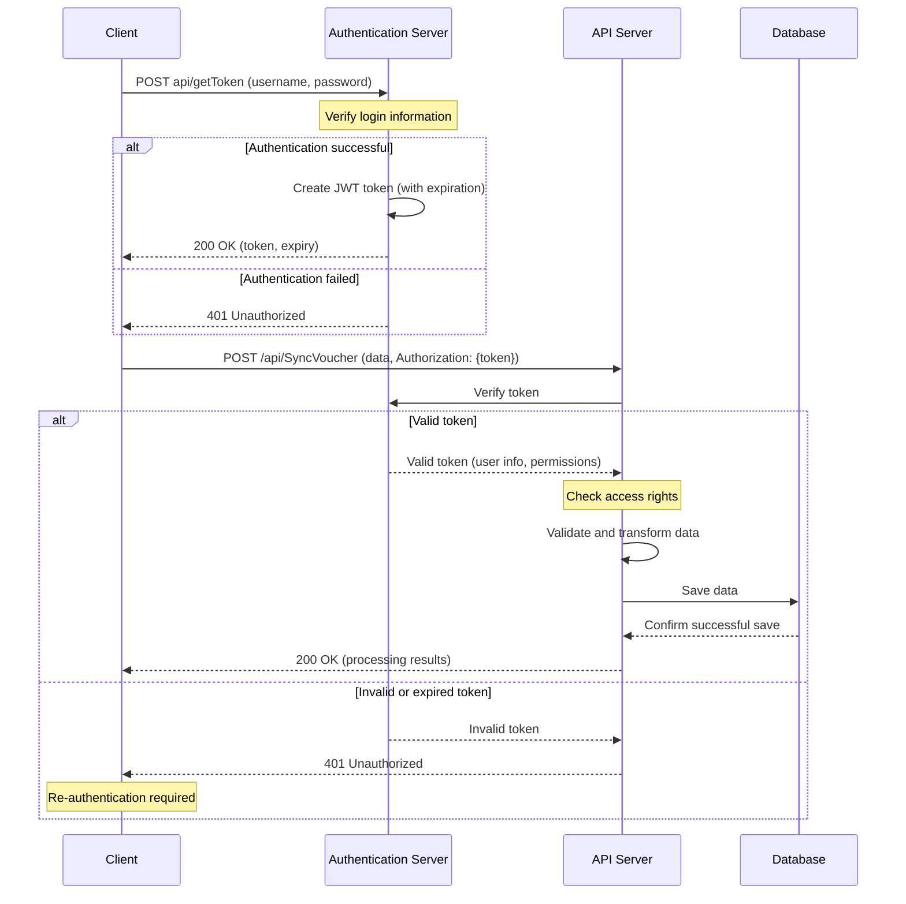

import ThemedImage from '@theme/ThemedImage';

# Fast ERP API Documentation

## Introduction

Explore our guides to find your suitable solutions by familiarizing yourself with our latest documentation including bussiness models, developer guides, API reference and more...

## Key Features

- **Secure Authentication**: The system uses token-based authentication to ensure API security.
- **Master Data Synchronization**: Supports synchronization of category data such as customers, materials, cases...
- **Complex Document Synchronization**: Supports synchronization of multi-level document data such as purchase invoices, sales invoices...
- **Data Queries**: Provides the ability to query data from the system.

## Data Processing Flow

<figure style={{textAlign: 'center'}}>
  <figcaption style={{marginTop: '10px', fontSize: '14px', fontStyle: 'italic'}}>
    Figure 1: API Data Processing Flow Diagram
  </figcaption>
</figure>

### 1. Authentication and Token Retrieval

- Client sends authentication request with login information (username/password).
- The system verifies the information and creates a token.
- The token is returned to the client along with its expiration time.

### 2. Send Data Processing Request

- Client sends a request with the authentication token in the header.
- API verifies the token and access rights.

### 3. Data Processing

- Valid data is transformed and saved to the database.
- The system processes related business logic.

### 4. Response

- Processing results are returned to the client.
- In case of an expired token, the system returns an error code requesting the client to re-authenticate.

## Getting Started with Integration

# Getting Started with the API

To start using the API, you need to:

1. Register and obtain authentication credentials (username/password).
2. Learn about [authentication and security](./authentication).
3. Explore the available API endpoints in the list below:

| API                                                | Format                | API Defined by |
| -------------------------------------------------- | --------------------- | -------------- |
| [Category Data Synchronization](./api/sync-data)   | POST /api/SyncData    | Fast           |
| [Voucher Data Synchronization](./api/sync-voucher) | POST /api/SyncVoucher | Fast           |
| [Get Data](./api/get-data)                         | POST /api/GetData     | Fast           |
